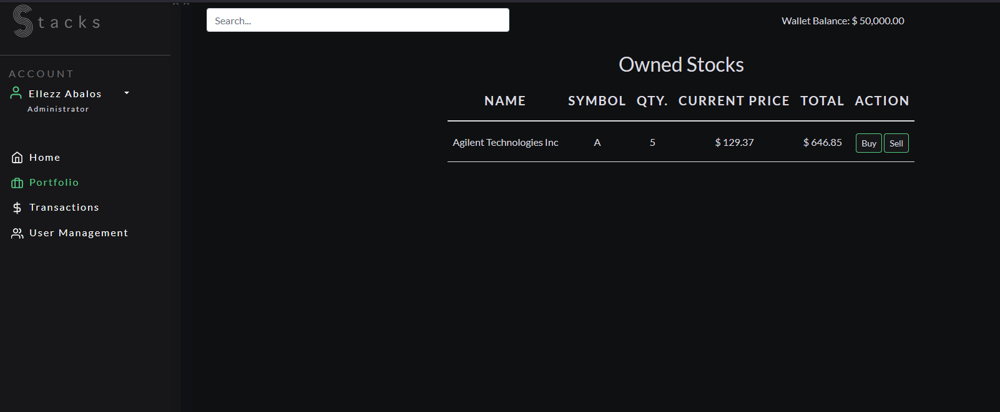
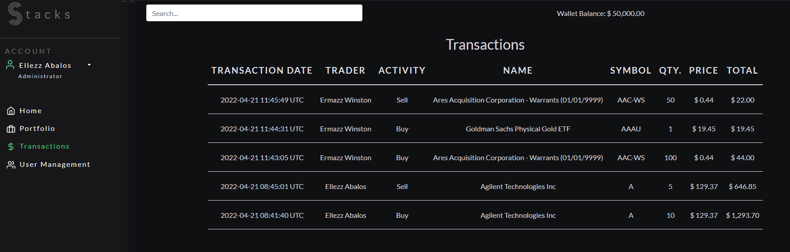
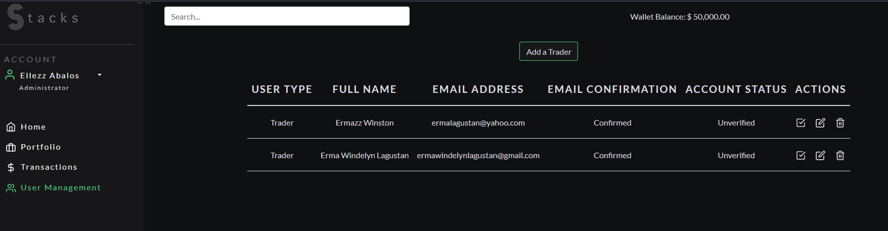

[](https://github.com/abalos-elle/stocks-app/graphs/contributors)
[](https://avion-stocks-app.herokuapp.com)


# About the Project
Stocks app is a backend project containing listings of companies and stock trends from AlphaVantage API, and utilities for you to buy and sell and manage your portfolio.








## Built With
### Technologies
* [Ruby on Rails Version 6.1.4.6](https://guides.rubyonrails.org/v6.1/)
* [Postgres](www.postgresql.org/)
* [JavaScript](https://www.javascript.com/)
### Third Party Packages
* [Bootstrap](https://getbootstrap.com/)
* [Devise Gem](https://github.com/heartcombo/devise)
* [Httparty](https://github.com/jnunemaker/httparty)
* [AlphaVantageRB gem by StefanoMartin](https://github.com/StefanoMartin/AlphaVantageRB)
* [Chart.js](https://www.chartjs.org/)


# Getting Started
## Prerequisites

## Installation

1. Clone the repo
   ```sh
   git clone https://github.com/abalos-elle/stocks-app.git
   ```
2. Build gems and installation packages
   ```sh
   bundle install
   yarn install
   ```
3. Get a free API key from [AlphaVantage](https://www.alphavantage.co/)
4. Enter your API key in the Rails Credentials file
   ```sh
   EDITOR="code --wait" rails credentials:edit
   ```
   Add these lines
   ```ruby
    alphavantage:
        key: <Your API key>
   ```
5. Install and run the redis server
   ```sh
   sudo apt install redis-server
   redis-server --daemonize yes
    ```
5. Check if the redis server is running
   ```sh
   redis-cli ping

   This command should return PONG
    ```    
6. Setup the database
    ```sh
    rails db:create
    rails db:migrate
    rails db:seed
    ```  
6. Run the application
    ```sh
    rails s
    ```  
